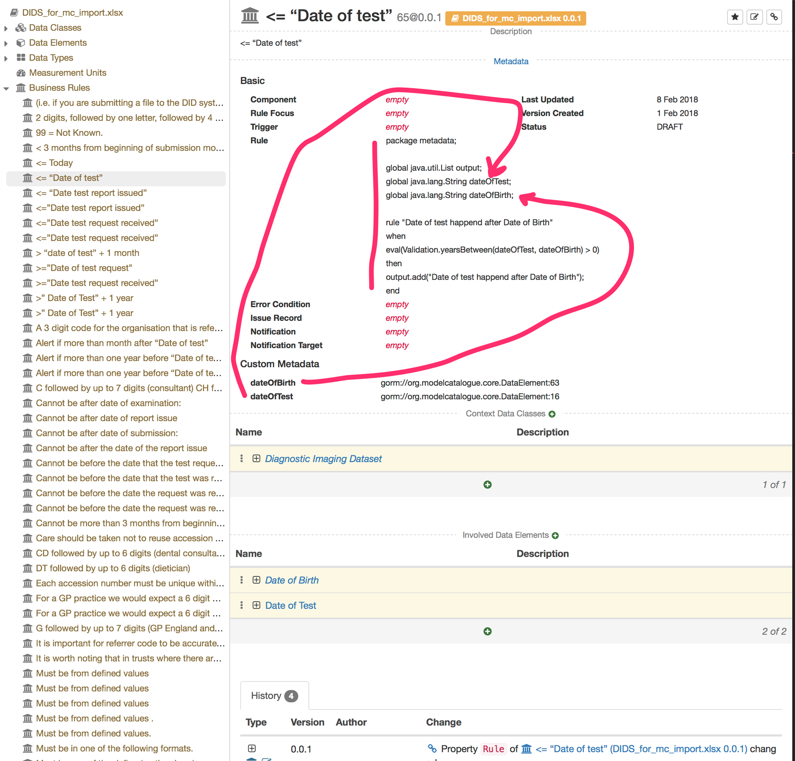

# Metadatasentinel

Demonstration application to show use of MDX as validator source

**Metadata Sentinel** consumes rules exposed by MDX at endpoint: 

`/api/modelCatalogue/core/validationRule/rules`

Note: that endpoint is only available at branch:  

https://github.com/MetadataConsulting/ModelCataloguePlugin/tree/drools

Currently that endpoint does not require authentication.

## Description

This applications allows the user to import Data as CSV format and a mapping comma separated string. 

If you import a CSV file of two columns

```
NHSNumber,NHSNumberStatus
"1234567890","01"
"1234567890","01" 
```

You need to create a mapping string for each of the elements.

`gorm://org.modelcatalogue.core.DataElement:53,gorm://org.modelcatalogue.core.DataElement:57,` 

If one of your csv values does not match any MDX element leave the value in the mapping blank.

For example: 

  ```
Price,Color,NHSNumber,NHSNumberStatus
10,"Red","1234567890","01"
20"Blue","1234567890","01" 
  ```
  
Since you don't have matches for Price and Color we have blank value. See leading commas in the next example:
  
`,,,gorm://org.modelcatalogue.core.DataElement:53,gorm://org.modelcatalogue.core.DataElement:57,`  

### DRL rules

The project contains a class `metadata.Validation` to ease drl validation rule creation.

Next is an example of DRL rule 

```
package metadata;

global java.util.List output;
global java.lang.String diagnosticTestDate;
global java.lang.String dateOfBirth;

rule "Difference between diagnosticTestDate and dateOfBirth is larger than 18"
when
    eval(Validation.yearsBetween(diagnosticTestDate, dateOfBirth, 'yyyy-MM-dd') < 18)
then
    output.add("Difference between diagnosticTestDate and dateOfBirth is larger than 18");
end 
```

You need to include  DROOLS Global name `output` of type `java.util.List`. When you find a violation you should add a string describing the rule violation to that list.

The previous example uses two variables `diagnosticTestDate` and `dateOfBirth`. You need to define in 
the MDX Business Rule which elements those variables correspond to. 

See screenshot: 


  

## Technology
 
This project is a [Grails 3](http://grails.org) application.

## Configuration 

You can configure the MDX server URL using configuration parameter `metadata.url`. 

Add to `grails-app/conf/application.yml`

```
metadata:
    url: http://localhost:8080
```

### Persistence
The app GORM for Hibernate implementation as an data access toolkit. It uses MySQL. You will 
need to configure your database url, user, password at `grails-app/conf/application.yml`. 


## Running

To run the app

`./gradlew -DJDBC_CONNECTION_STRING=jdbc:mysql://127.0.0.1:8889/metadatasentinel_dev -DJDBC_USERNAME=root -DJDBC_PASSWORD=root bootRun`

To run the unit tests:

`./gradlew test`

To run the integration tests:

`./gradlew -DJDBC_CONNECTION_STRING=jdbc:mysql://127.0.0.1:8889/metadatasentinel_dev -DJDBC_USERNAME=root -DJDBC_PASSWORD=root iT`